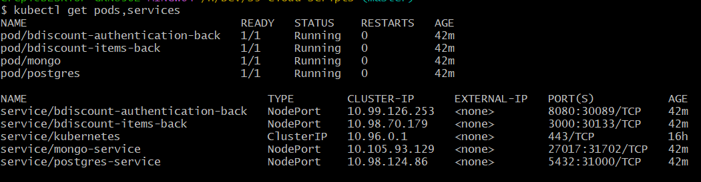

# Project Cloud S9

## Repo link :

[https://github.com/theoCrepinDev/s9-cloud-scripts](https://github.com/theoCrepinDev/s9-cloud-scripts)

[https://github.com/theoCrepinDev/s9-cloud-scripts](https://github.com/theoCrepinDev/s9-cloud-scripts)

## Services description

### Service 1

The first service is called bdiscount-authentication

The goal of this service is to handle the authentication of the user to the application.

On this API, we will be able to call it to :

- SignUp to the application calling POST /api/register
- Login to the applciation calling POST /api/login to get a jwt
- Verify and get user information from a jwt using /api/check

This will allow to other service to know the user without having to handle the user database and jwt.

This service is code in Java Spring with a PostgreSQL database.

## Deployement

## Note: There is a global script to launch/clean the whole architecture (APIs on minikube + gateway + front)

### Service 1 deployement

First thing to do to deploy a service to the kubernetes cluster is to create a docker image of the service and push it to docker-hub.

```jsx
FROM openjdk:17-alpine

WORKDIR /app
ENV SPRING_PROFILES_ACTIVE=production
ADD build/libs/*-SNAPSHOT.jar app.jar

EXPOSE 8080

CMD ["java", "-jar", "/app/app.jar"]
```

run the commande :

```jsx
docker build -t tekxover/bdiscount-authentication-back:<Version>
```

to create the docker image 

And then push it to docker-hub 

```jsx
docker push tekxover/bdiscount-authentication-back:<Version>
```

Then on kubernetes we need to first set up the postgresql database:

postgres.yaml

```yaml
apiVersion: v1
kind: Pod
metadata:
  name: postgres
  labels:
    app: postgres
spec:
  containers:
  - name: postgres
    image: postgres
    ports:
      - containerPort: 5432
    env:
    - name: POSTGRES_PASSWORD  
      value: monmotdepasse
---

apiVersion: v1
kind: Service
metadata:
  name: postgres-service
spec:
  type: NodePort
  selector:
    app: postgres
  ports:
    - port: 5432
      targetPort: 5432
      nodePort: 31000
```

We can know create this pod and service in the cluster:

```yaml
kubectl apply -f postgres.yaml
```

This while create a pods named postgres to run postgres containers and alson a service named postgres to have a static ip that will redirect traffic to the pods and containers

Now we can create a yaml file that while create pods and service for le authentication service with the image available on docker-hub

```yaml
apiVersion: v1
kind: Pod
metadata:
  name: bdiscount-authentication-back
  labels:
    app: bdiscount-authentication-back
spec:
  containers:
    - name: bdiscount-authentication-back
      image: tekxover/bdiscount-authentication-back:<VersionTag>
      ports:
        - containerPort: 8008
---

apiVersion: v1
kind: Service
metadata:
  name: bdiscount-authentication-back
spec:
  type: NodePort
  selector:
    app: bdiscount-authentication-back
  ports:
    - port: 8080
      targetPort: 8080
```

And apply it with

```yaml
kubectl apply -f bdiscount-authentication-back.yaml
```

Done, our authentication service is running on minikube. We can use the command:

```yaml
minikube service bdiscount-authentication-back --url
```

To have access to the authentication service url and use postman to call the api.

### Service 2

The second service will be use to get user items list using only the JWT token. He will store those items in an other DB (mongo db).

Their is two routes, one to get user items and the other one to post user item in the list. The api will check the token using the authentication service and then use the user info to store/get items.

We are doing the same way, we build and push a docker image to the docker hub.

```jsx
tekxover/bdiscount-items-back:<version>
```

We can now create a mong.yaml that take care to create the mongo database in the cluster

```jsx
apiVersion: v1
kind: Pod
metadata:
  name: mongo
  labels:
    app: mongo
spec:
  containers:
  - name: mongo
    image: mongo
    ports:
    - containerPort: 27017
    env:
        - name: MONGO_INITDB_ROOT_USERNAME
          value: root
        - name: MONGO_INITDB_ROOT_PASSWORD
          value: example
        - name: MONGO_INITDB_DATABASE
          value: ShoppingListsDb
---

apiVersion: v1
kind: Service
metadata:
  name: mongo-service
spec:
  type: NodePort
  selector:
    app: mongo
  ports:
    - port: 27017
      targetPort: 27017
```

Then we create a bdiscount-items-back.yaml file that create the items Api

```jsx
apiVersion: v1
kind: Pod
metadata:
  name: bdiscount-items-back
  labels:
    app: bdiscount-items-back
spec:
  containers:
    - name: bdiscount-items-back
      image: tekxover/bdiscount-items-back:1.1
      ports:
        - containerPort: 3000
---

apiVersion: v1
kind: Service
metadata:
  name: bdiscount-items-back
spec:
  type: NodePort
  selector:
    app: bdiscount-items-back
  ports:
    - port: 3000
      targetPort: 3000
```

After all this done you should have all thoses services and pods



### Deployement Gateway

After everything is deploy, we can (to simplify the use of the architecture) deploy a gatway to access every services from the same address.

We first need to define a gateway.yaml to define the gateway

```yaml
apiVersion: networking.istio.io/v1alpha3
kind: Gateway
metadata:
  name: microservice-gateway
spec:
  selector:
    istio: ingressgateway
  servers:
    - port:
        number: 80
        name: http
        protocol: HTTP
      hosts:
        - "*"
---

apiVersion: networking.istio.io/v1alpha3
kind: VirtualService
metadata:
  name: authentication-gatway
spec:
  hosts:
    - "*"
  gateways:
    - microservice-gateway
  http:
    - match:
        - uri:
            prefix: /authentication/
      rewrite:
        uri: /
      route:
        - destination:
            port:
              number: 8080
            host: bdiscount-authentication-back.default.svc.cluster.local
---

apiVersion: networking.istio.io/v1alpha3
kind: VirtualService
metadata:
  name: items-gateway
spec:
  hosts:
    - "*"
  gateways:
    - microservice-gateway
  http:
    - match:
        - uri:
            prefix: /items/
      rewrite:
        uri: /
      route:
        - destination:
            port:
              number: 3000
            host: bdiscount-items-back.default.svc.cluster.local
```

then we can deploy it by using 

```yaml
kubectl deploy -f gateway.yaml
```

And start using it by using

```yaml
./ingress-forward.sh
```

where ingress-forward is 

```yaml
#!/bin/sh
echo Open Ingress at http://localhost:31380/
kubectl -n istio-system port-forward deployment/istio-ingressgateway 31380:8080
```

this will forward all the request on localhost:31380 to the gateway  and we can now access all of our service on the same host:port with /auth/ for Service 1 and /items/ for Service 2

Now we can interact with the architecture using postman. 
We have decide to create a tiny react app to show the architecture working. On the repo you can go in the bdiscount-front folder and run:

```jsx
npm i
npm run dev
```

Access the app on : [http://localhost:5173/](http://localhost:5173/)


## Launch everything in one command

We have had scripts to launch and clean everything easly.

### Launch

From the repo launch:

```jsx
./launch-env.sh
```

This will create all resources and wait them be ready before installing depencies for the front and launch it.

### Clean

After testing the solution, you can use:

```jsx
./clean-env.sh
```

To clean everything.